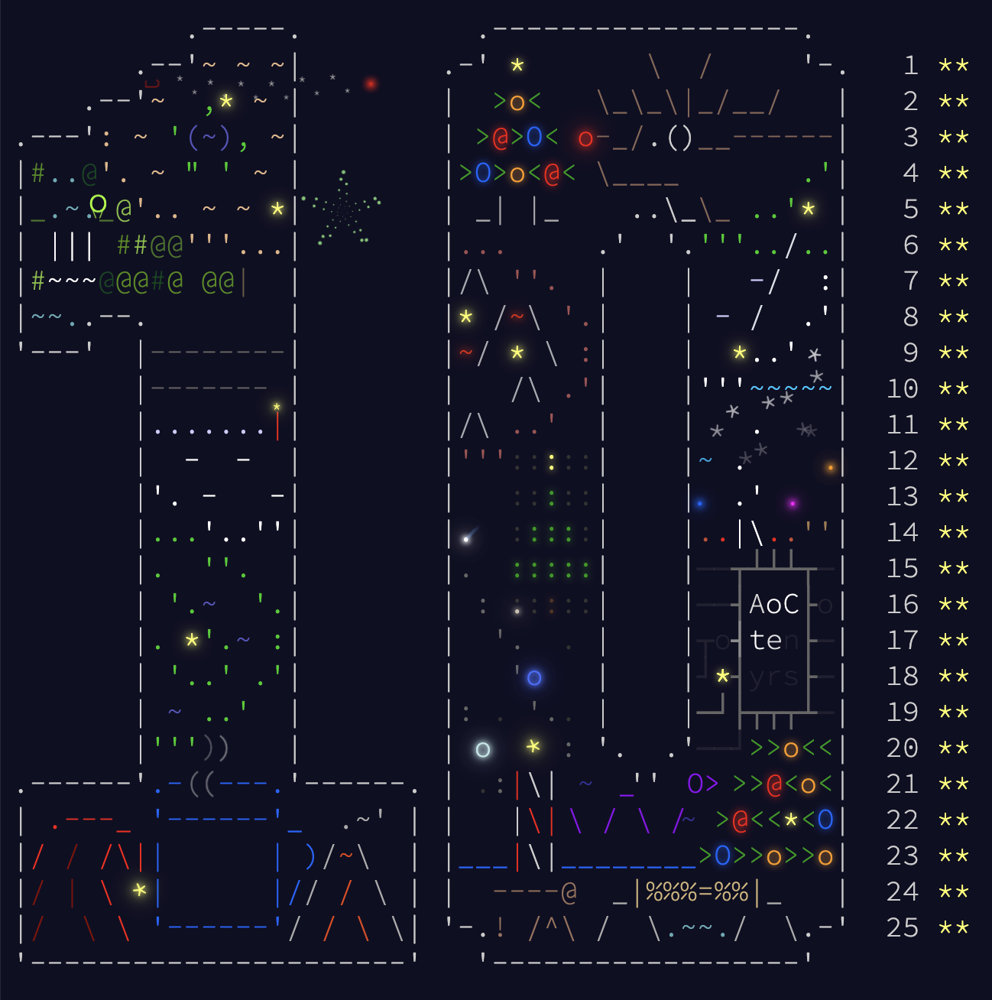

# 🎄 Advent of Code 2024 - Typescript 🎄

Attempt at [Advent Of Code 2024](https://adventofcode.com/2024) written in Typescript with the following aims:

- Optimise time taken between part 1 and part 2(to avoid getting up at 5am 😅)
  - [Leaderboard for this](https://night-owl-aoc.vercel.app/)
- Not the prettiest code but goal was just to complete this year

_Completed: 28/12/2024_

---

_Forked from [bpiggin/advent-of-code-typescript-starter](https://github.com/bpiggin/advent-of-code-typescript-starter)_
